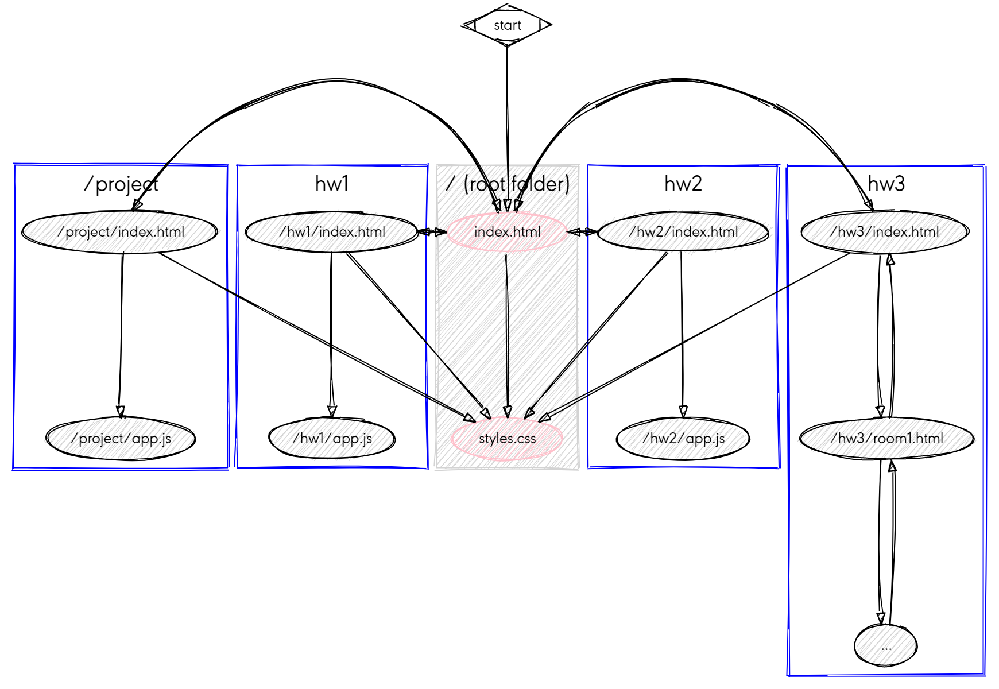
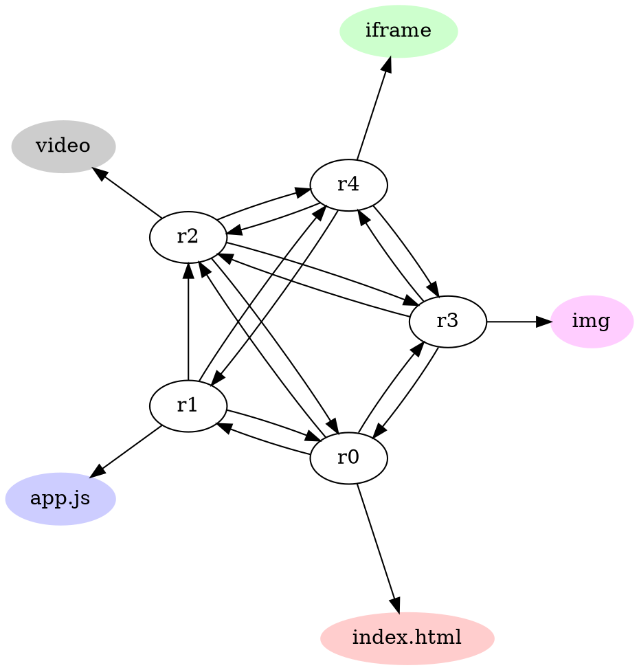
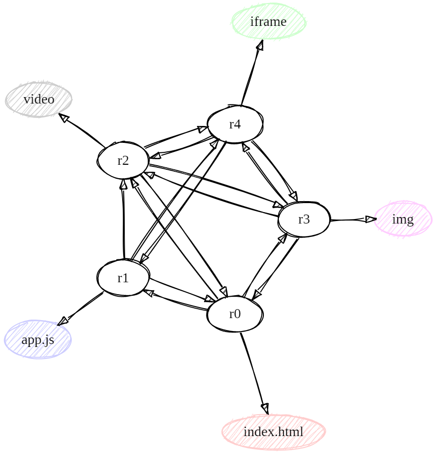

# Homework 3: Weave A Web

## Tidy up Your Links

Ensure that your web page has a consistent and working set of hyperlinks. Each page should either link to the page above (e.g. your root `/index.html`), or to another page.

* Add an index to your root `/index.html`



## Create your Web

Use a tool like [Sketchviz](https://sketchviz.com/new) to create your map of a linked set of **five rooms**.

We covered an example in class. Here is some source GraphViz code that draws the following figure:





Save the resulting file as `map.png` and place it inside your `hw3` folder. You can insert your map into your web page as follows:

```html
<div></div>
```

The div is used to separate this content from the remaining content.

## Implementation

Create your directory `/hw3` and put an `index.html` that contains a link up to the root `/index.html` and uses your style sheet `/styles.css`.

Your `index.html` should give you a map and a hyperlink to `room1.html`. Use the naming scheme `roomN.html` where `N` is `1` to `6`.

Each room should contain three hyperlinks to a neighboring room. Place your hyperlinks using a bulleted list as follows. This may be room 1.

```html
<ul>
<li>One path goes to a <a href="room2.html">short description of room 2</li>.
<li>Another path goes to <a href="room3.html">short description of room 3</li>.
<li>The other path goes to <a href="room4.html">short description of room 4</li>
<li>There is also <a href="index.html">a path to exit this place</a>.</li>
</ul>
```

## The contents of a room.

Each room should have something interesting inside of it. Make sure you use each one of these at least once. Make sure it's tasteful and use CSS to dress it up.

* `<script>`: click a button and make it change the page somehow.
* ``: put an interesting image on your page.
* `<video>`: put a short web video on your page. If you don't know what to include, try [Big Buck Bunny](https://www.bigbuckbunny.org/).
* `<iframe>`: embed another website into one of the rooms.

## Alternate Ending

If your project is struggling, you can use this homework as your project, but only if you use **nine rooms** and create some interesting descriptions. Each page should consist of a paragraph and image/JS applet/etc. The visitor to this site should get a sense of story and progression as they travel between rooms.

Here is a list of ideas you could try (feel free to pick your own theme, of course!)

* Color changes everything
* Shadows
* Beginning of time
* Out of this world
* The worst restaurant ever
* A Journey
